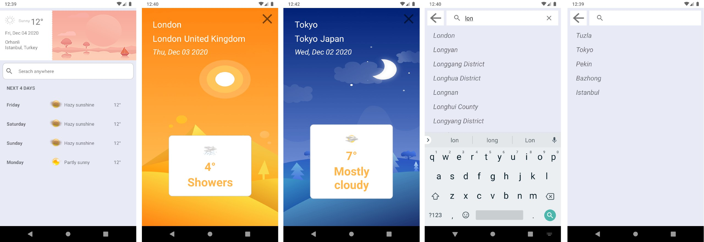

<h1 align="center">LocationForecastApp</h1>

## :star2: App Information
Developed using AccuWeather API,

The application where the weather information can be learned according to the current location of the user or the searched location.

And can view detail of daily and next 4 daily forecast information from user current location or searched locations around the world with auto completed search

Able to view your last search locations list.

## :rocket: Infrastructure, Technologies, Libraries Used 
* [Design Pattern: MVVM ]()
* [Single Activity Multi Fragment : SAMF ]()
* [AccuWeatherApi ](https://developer.accuweather.com)
* [Android Jetpack ](https://developer.android.com/jetpack)
* [Navigation Component ](https://developer.android.com/guide/navigation/navigation-getting-started)
* [Retrofit2 ](https://square.github.io/retrofit/)
* [Lifecycle ](https://developer.android.com/jetpack/androidx/releases/lifecycle)
* [LiveData ](https://developer.android.com/reference/androidx/lifecycle/LiveData)
* [ViewModel ](https://developer.android.com/topic/libraries/architecture/viewmodel)
* [Room ](https://developer.android.com/topic/libraries/architecture/room)
* [Material Design Principles]()
* [Clean Code]()
